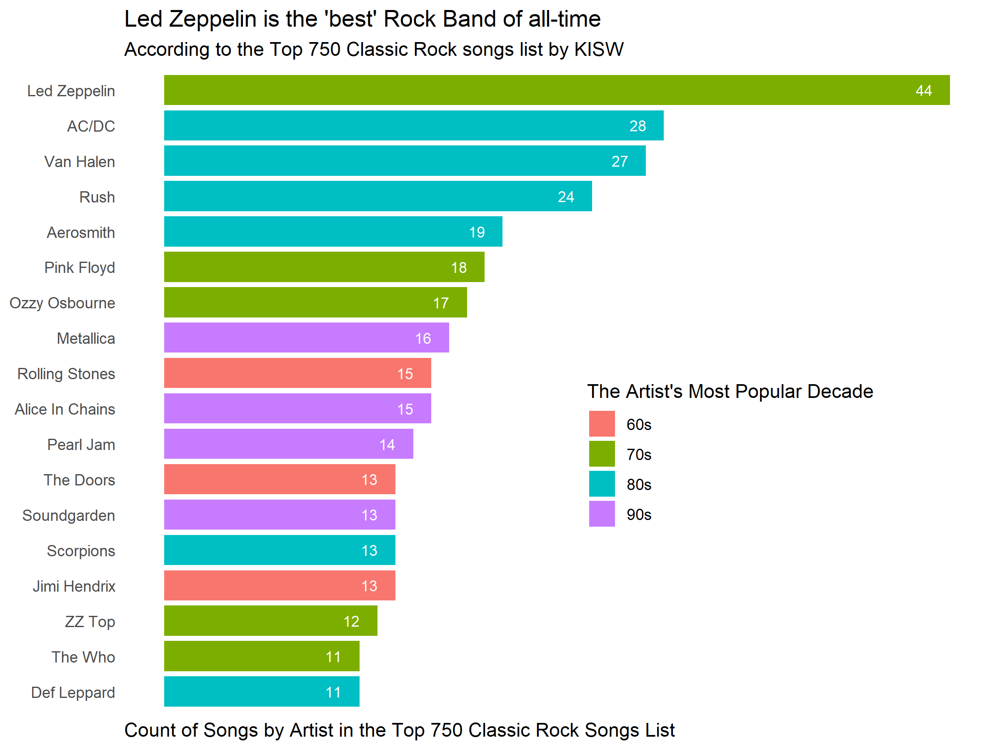
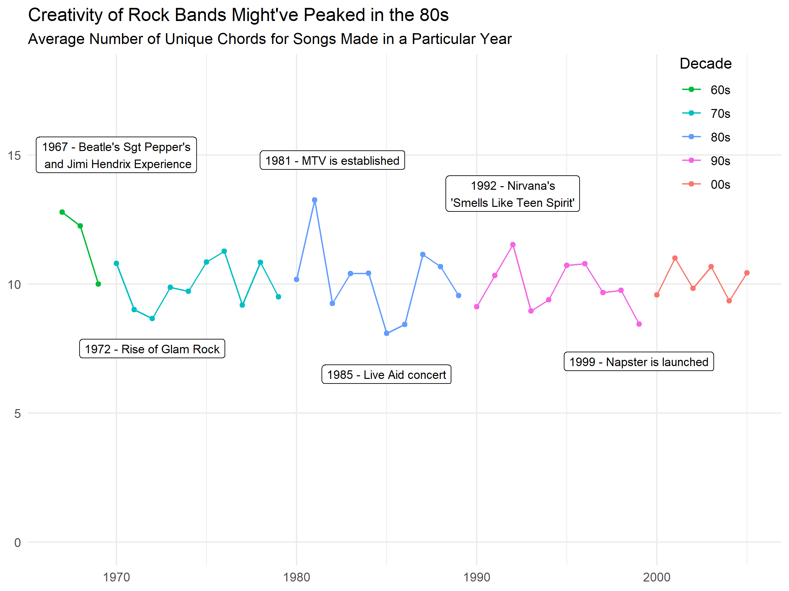
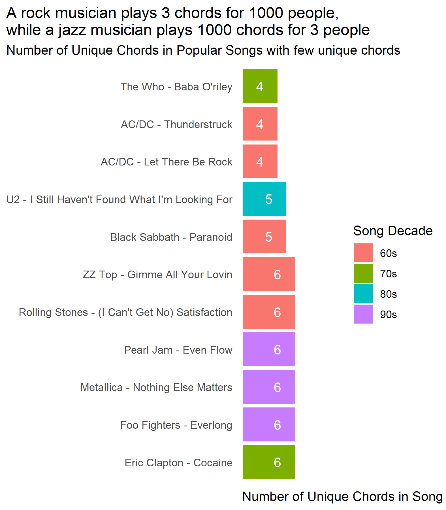
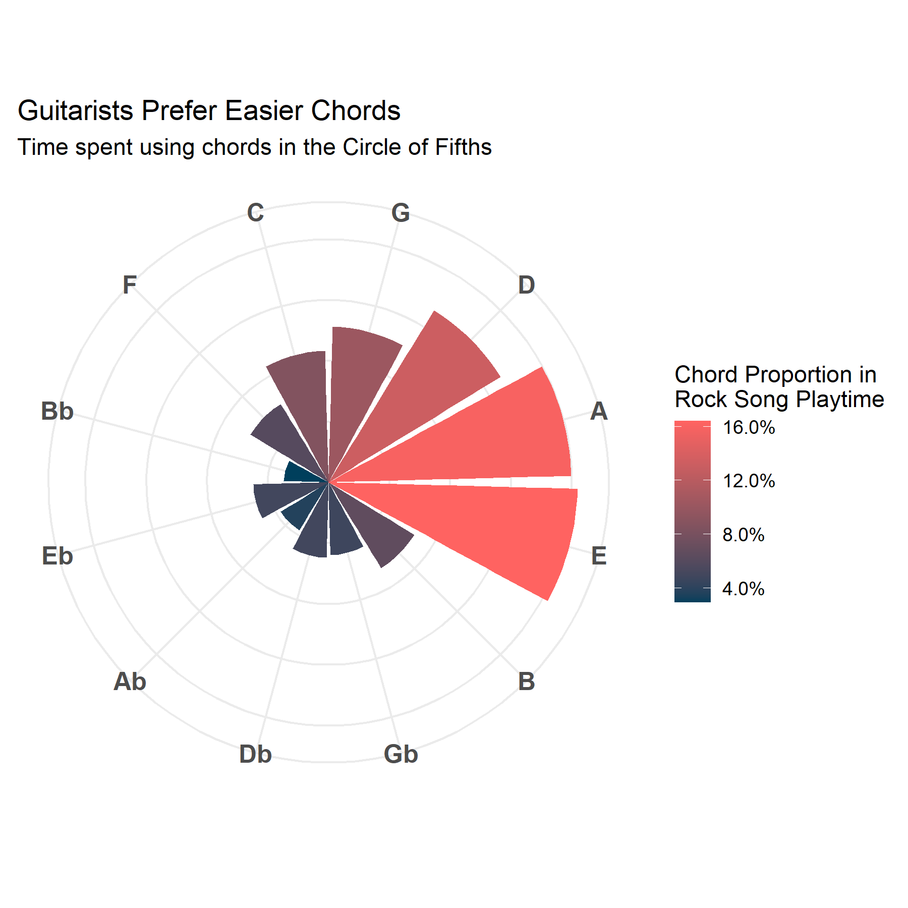
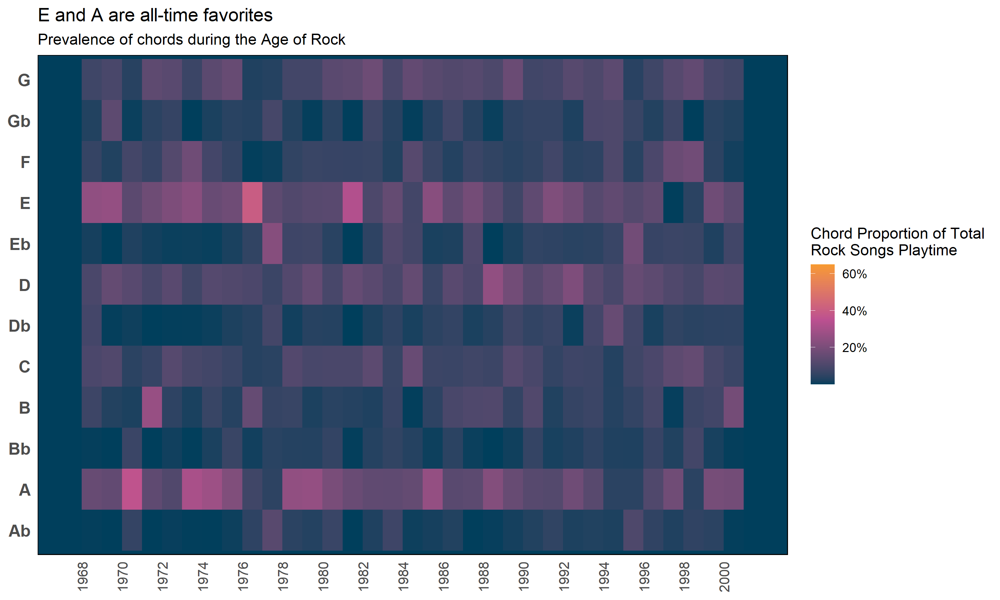
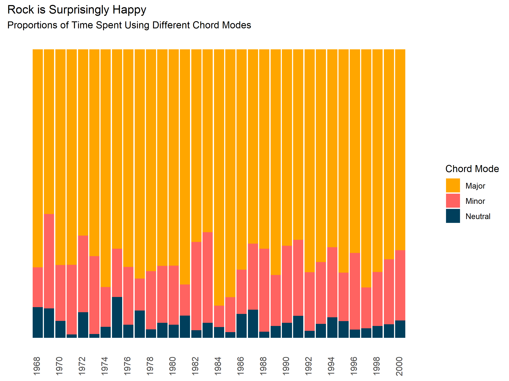

# RockSongChordAnalysis
**LTAT.02.015 Music Information Retrieval** 
Ilmar Uduste

This project is meant for analysing the chords prevalent in rock music. 

The dataset was KISW (Rock of Seattle's) Top 750 Classic Rock songs.

**Process flow:**
<ol>
<li>Convert songs from .mp3 to .wav (*mp3_to_wav.py*)</li>
<li>Spliced each song from 30s to 120s (for a total duration of 90s)
 (*mp3_to_wav.py*)</li>
<li>Ran Automatic Chord Recognition (ACR) on each spliced song (<i>ChordRecognitionMIDITrainedExtractor</i>).</li>
<li>Transformed the ACR output files from .lab format to a unified .csv file (<i>labs_to_pandas.py</i>)</li>
 <li>Gathered metadata from original .mp3 files (<i>metadata_to_csv.py</i>).</li>
<li>Analysed chords and metadata found in processed_data with <i>plots.R</i> and made plots with the same script (plots were saved into the folder <i>plots</i>).</li>

</ol>

The presentation of this project is in <i>MIR Project Uduste.pdf</i>.

**ChordRecognitionMIDITrainedExtractor** is blatantly forked from here: https://github.com/Xiao-Ming/ChordRecognitionMIDITrainedExtractor

<b>The final analysis in plots:</b>

